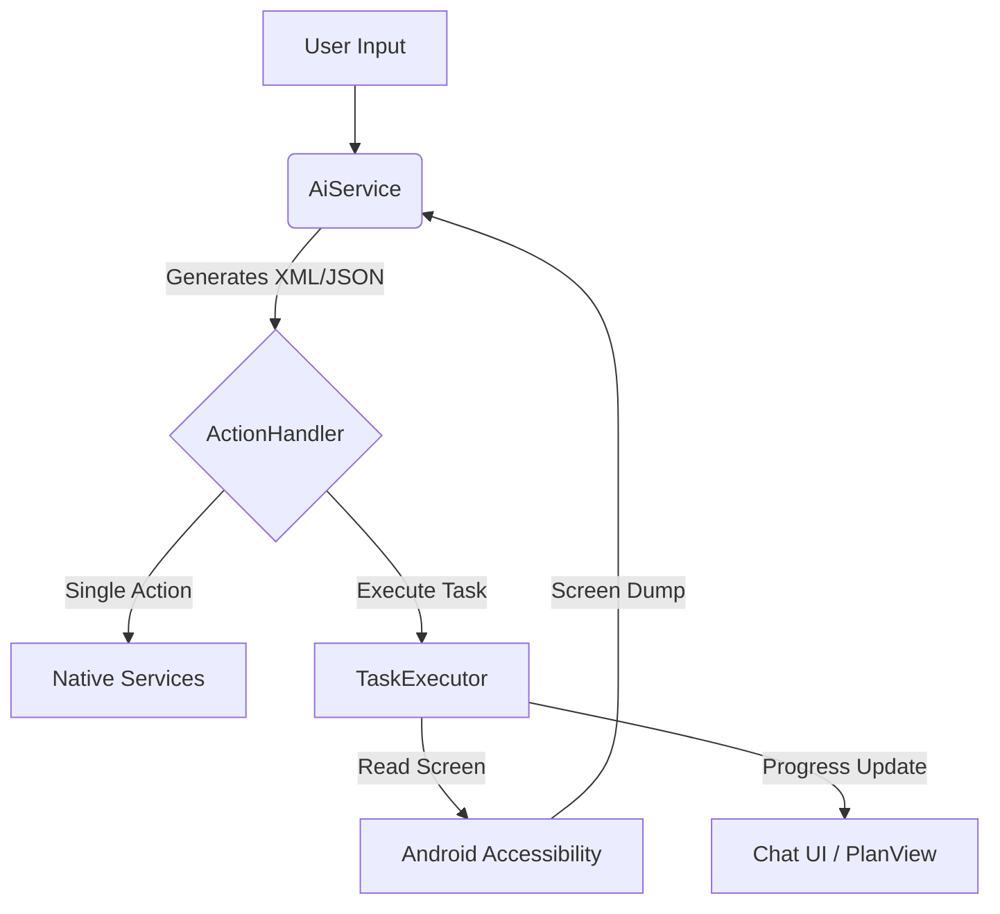

# PrivateAgent – Project Skill

## 🏗️ Project Overview

**PrivateAgent** is a Flutter/Dart + Kotlin Android automation agent that uses LLMs to control an Android phone via natural language commands.

### Tech Stack
- **Frontend:** Flutter (Dart) utilizing Material 3.
- **Native Layer:** Kotlin (Android Accessibility Service).
- **AI Integration:** OpenAI-compatible Chat Completion API (defaults to DeepSeek).
- **State Management:** Currently `setState()` (Refactoring to Riverpod planned).
- **Storage:** SharedPreferences for configuration keys.
- **Remote Integration:** Telegram Bot API via long polling.

### Core Architecture Flow

---

## 📁 Codebase Structure & Responsibilities

### Models
| File | Purpose |
|-------|-------|
| `lib/models/agent_action.dart` | Action data model & list of available actions |
| `lib/models/chat_message.dart` | Chat message model & action execution results |

### Screens
| File | Purpose |
|-------|-------|
| `lib/screens/home_screen.dart` | Main chat-style assistant layout |
| `lib/screens/settings_screen.dart` | Large settings configuration layout |

### Core Services
| File | Purpose |
|-------|-------|
| `lib/services/ai_service.dart` | API interface, prompt storage, and history |
| `lib/services/action_handler.dart` | Action command router and case dispatcher |
| `lib/services/task_executor.dart` | Multi-step accessibility-guided execution loop |
| `lib/services/screen_automation_service.dart` | MethodChannel interface to Android Accessibility |
| `lib/services/telegram_service.dart` | Long polling remote Telegram interface |

### Action Services
| File | Purpose |
|-------|-------|
| `lib/services/app_launcher_service.dart` | Dynamic app search and launch logic |
| `lib/services/communication_service.dart` | Calls, text messages, and email drafts |
| `lib/services/contacts_service.dart` | Read access to Android contact lists |
| `lib/services/alarm_service.dart` | Intents to register system timers/alarms |
| `lib/services/system_control_service.dart` | Volume and screen brightness controls |
| `lib/services/shizuku_service.dart` | ADB-privilege command executions |
| `lib/services/notification_service.dart` | Local status notifications |
| `lib/services/voice_service.dart` | STT and TTS speech utilities |

---

## ⚠️ Known Issues

### 🔴 Critical
1. **Telegram Chat Security:** Bot accepts actions from any incoming user message (needs whitelist filter).
2. **Plaintext Keys:** API keys are stored unprotected in SharedPreferences.
3. **ADB Command Injection:** Shizuku service runs unvalidated strings.
4. **Sync Issues:** `availableActions` array does not match actual supported actions in ActionHandler.

---

## 📏 Coding Conventions

- **Colors:** Do not use hardcoded standard colors (`Colors.green`, `Colors.red`, etc.). Use semantic color maps from context themes.
- **HTTP client:** Set a strict timeout and retry threshold on requests.
- **Log management:** Use `developer.log()` or a package logger instead of `print()`.
- **MethodChannel:** Bridge target is `'com.privateagent/accessibility'`.
- **Android namespace:** `com.orailnoor.privateagent`.
